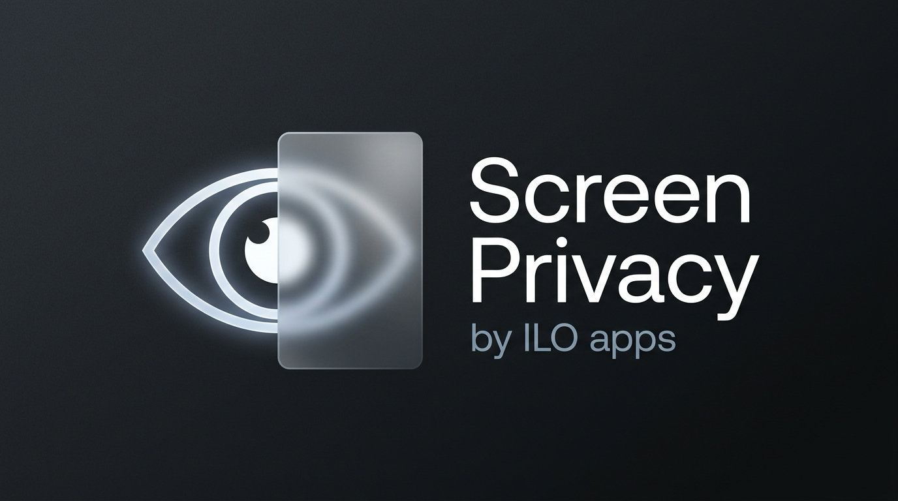
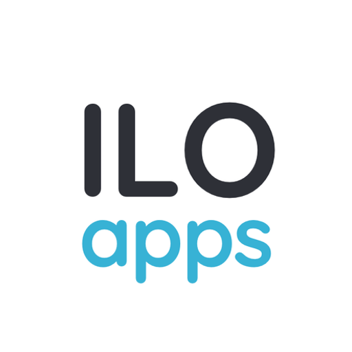

# Screen Privacy

[](https://github.com/mattivilola/screen-privacy-blur-app/actions/workflows/ci.yml)

<p align="center">
  
</p>

<p align="center">
  
</p>

A small native macOS menu bar app that covers your displays when you look away and uncovers them when you face the camera again. When macOS allows screen capture, each cover uses one frozen, blurred snapshot of that display; it is not a live screen-blur feed.

**Early prototype.** Camera accuracy, display coverage, and energy use need hardware validation before relying on it. Requires macOS 14 or later and a camera. Written in Swift 6 with AppKit, AVFoundation, Vision, and [Sparkle](https://sparkle-project.org/) for signed updates.

## Use

1. Install a signed, notarized DMG from [GitHub Releases](https://github.com/mattivilola/screen-privacy-blur-app/releases) when one is available, or build and open the app using the commands below.
2. Choose **Enable protection** (or press **⌥⌘P**) and allow camera access.
3. Face the camera. The screen uncovers after steady attention is detected.
4. Use the eye icon in the menu bar to pause protection, change settings, or quit.

Press **⌥⌘P** (Option-Command-P) at any time to immediately toggle protection on or off with a global shortcut without opening the menu.

Choose **Preview for 5 seconds** to see the frozen blur, logo, and message without looking away. It works while protection is paused. Preview and enabling protection can ask for Screen Recording permission because they may create a snapshot; select **Screen Capture Permission…** in the menu to request it directly. Selecting Preview again restarts its five-second timer. Afterward, the app returns to normal protection behavior; an active cover stays on if attention detection still requires it.

**Tolerance** controls how much head movement is allowed and how long the app waits before covering. Moving it right makes detection more forgiving.

**Blur level** controls how strongly the frozen cover blurs the screen. Dragging right keeps text more readable; dragging left hides more of the snapshot. The default is the middle, the app's original blur strength.

Use the **Camera** submenu to select between available FaceTime, external webcams, or Continuity Cameras, or leave it on **Automatic**. If your MacBook is closed in clamshell mode, it automatically ignores the suspended internal camera and falls back to connected external cameras.

Choose **Launch at Login** to launch Screen Privacy automatically whenever you log into your Mac.

Choose **Check for Updates…** to check the signed release feed. Sparkle also checks automatically; update downloads come from this project's GitHub Releases.

Choose **Custom message…** to set the text beneath the logo. It is limited to 120 characters and displayed in at most three lines, with automatic font sizing. The centered overlay stays within one third of each screen's width and height; unusually wide text is truncated if needed to keep it readable. Leave the message blank to show “Screen Privacy”.

All preferences are stored locally and persist between launches. Protection also resumes on subsequent launches if it was enabled and camera permission remains available.

Keep your camera close to your screen's center. This app estimates head direction relative to the camera, not your eye gaze or which monitor you are reading. Looking only with your eyes may not trigger the cover.

## Build

Install Xcode with the Swift 6 toolchain and select it with `xcode-select`, then clone the source:

```sh
git clone https://github.com/mattivilola/screen-privacy-blur-app.git
cd screen-privacy-blur-app
```

Run `make` to see every local and release command. Build and launch locally:

```sh
make run
```

This builds an ad-hoc signed app and opens it in the menu bar. Quit an already running copy before launching an updated build.

Build and test separately:

```sh
swift test
./scripts/test-release-tools.sh
./scripts/build-local-app.sh
```

The script prints the path of a locally signed `.app`. Open that bundle so macOS can associate camera permission with the application. `swift run` is not the recommended camera workflow. Local ad-hoc signatures are for development; public downloads should be Developer ID signed and notarized.

See [release instructions](docs/RELEASING.md) for universal builds, Developer ID signing, notarization, DMG packaging, a signed Sparkle feed, and GitHub Releases. Signing credentials and the private update key belong in your Keychain, not this repository.

## Privacy and limitations

- Camera frames are analyzed in memory on your Mac and discarded. The app has no accounts, analytics, or camera/screen uploads. Sparkle makes network requests to GitHub to check for and download signed app updates.
- Camera permission is required for attention detection. The camera indicator remains visible while camera capture is active. Microphone and Accessibility permissions are not requested.
- Screen Recording permission is optional and is requested only when you choose **Screen Capture Permission…**, enable protection, or start Preview. With permission, the app takes at most one ScreenCaptureKit snapshot (with CoreGraphics fallback) per display when making a cover, capturing below its own cover window so the cover is not captured into itself. It downsizes each image to a longest edge of at most 1600 pixels, applies a Gaussian blur (adjustable in the menu, by default about 12 screen points), and keeps only that blurred image for the visible cover. It does not capture audio, make video recordings, or continuously capture the screen. The unblurred image is transient memory only; no screen image is written to disk or sent over the network.
- If Screen Recording permission is missing or capture fails, the app keeps an opaque neutral cover. Protected/DRM content may be blanked by macOS within an otherwise usable snapshot. macOS can require the app to relaunch after a Screen Recording permission change.
- A frozen snapshot is safer than a live transparent or continuously updated blur for this purpose: once the snapshot is captured, later messages and window changes are not revealed beneath it. It also avoids the washed-out appearance of a system material blur and limits screen capture to cover transitions. This is a relative privacy benefit, not a security guarantee: the original scene can remain recognizable through blur.
- Update downloads are separate from the capture path: the screen image and camera frames are never sent to Sparkle or GitHub. The update feed and archives must be signed by the project's update key; the app checks these signatures before installing an update.
- This is **not authentication or a screen lock**. Any single person facing the camera can uncover the screen. Face detection can miss bystanders, fail in low light, or be fooled by an image.
- Multiple detected faces, invalid pose information, and camera errors cannot uncover a covered screen. Brief attention loss is debounced; lack of fresh camera frames triggers a cover after about 1.5 seconds.
- The overlay uses a frozen, Gaussian-blurred screen image where available, with the app icon and your message in a centered, rounded panel on each display. There is no white tint over the snapshot, and the blur strength can be changed in the menu. It stays static until the cover is removed or reset by a display/lifecycle change, so ordinary content changes behind it are not reflected. An opaque neutral fallback is used when a snapshot cannot be made. Blur can leave content recognizable. Menu bar and higher-level system UI may remain visible. Full-screen apps, Spaces, Mission Control, and display changes require verification on your setup.
- The overlay is mouse-transparent: applications keep running and keyboard/mouse input still reaches them. Pause from the menu bar before interacting with a covered display. It is not a guarantee of concealment in screenshots or screen sharing.
- The app cancels pending work and starts no new screen captures after receiving workspace sleep, inactivity, or lock notifications. Late results are discarded. Resuming or changing the display arrangement clears stale images and can create a fresh snapshot. These notifications are not a security boundary.

Use the macOS lock screen when you need access control or dependable concealment.

## Performance approach

The app requests 640×480 camera capture (or the low preset as a fallback) and a 4 FPS camera stream where supported, then runs face detection at most roughly 4 times per second on a serial utility queue. Late frames are dropped. Each cover capture performs one still capture per display, scales it to a longest edge of 1600 pixels, blurs it once, and reuses the result until uncovering. There is no screen-capture loop or per-frame screen redraw. Camera hardware, snapshot creation, and the compositor still consume power. CPU, memory, latency, and battery claims have not yet been measured.

The detection pipeline deliberately uses face rectangles with head angles instead of detailed eye landmarks or a separate neural model. Tolerance adjusts yaw (12–35°), pitch (12–30°), and look-away delay (0.35–1.25 seconds). Returning requires a narrower head-angle range and 0.35 seconds of steady attention, quantized by the frame cadence.

## Development

- `Sources/AttentionCore`: deterministic attention policy and timing.
- `Sources/OverlayUI`: message editing and responsive overlay layout.
- `Sources/SnapshotCore`: one-shot screen capture and local, color-preserving blur.
- `Sources/ScreenPrivacy`: menu bar app, camera pipeline, display covers.
- `Tests/AttentionCoreTests`: regression tests without camera access.
- [PLAN.md](PLAN.md): implementation scope and progress.
- [Manual validation](docs/VALIDATION.md): hardware checks and performance procedure.
- [App icon](docs/ICON.md): source artwork and macOS icon rebuild tooling.

See [CONTRIBUTING.md](CONTRIBUTING.md) for development and bug-report guidance and [SECURITY.md](SECURITY.md) for private vulnerability reporting.

## License

[MIT](LICENSE). Anyone may use, modify, and distribute the source under those terms. The bundled Sparkle framework's notices are in [THIRD_PARTY_NOTICES.txt](THIRD_PARTY_NOTICES.txt) and inside each app bundle.
